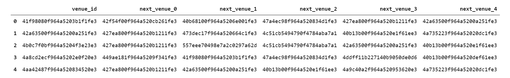
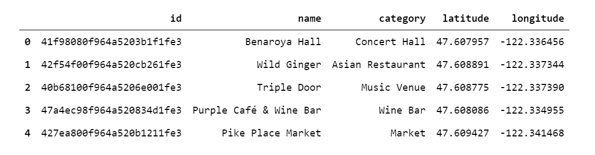

# Community Analysis of Next Venues in Seattle, WA 

## Introduction

Cross-promotions are an effective way for businesses to jointly promote their businesses and products or services while reducing marketing costs. These could include giving out coupons for a partner business or doing community events such as "bar hop bingo" to promote a set of local bars and pubs or as part of a fundraising event. However, as a business owner, it may be difficult to strategically decide which other business or businesses would be effective partners to target. Alternatively, as a community event planner it may be difficult to know which venues people would likely travel between in a punch card/bingo-type weekend event. Additionally, an individual business owner may want to know which venues customers typically visit prior to visiting their business, or which places customers travel to afterwards, in order to effectively place advertisements. These types of decisions are often simply based on geographical closeness, using the assumption that people often travel between venues which are near each other. However, locations that are near each other do not necessarily draw from the same customer base, due to a variety of factors such as prices, style, culture and offerings. Likewise, venues which may be located in entirely different neighborhoods may still be connected in terms of how customers go from one to another. Identifying clusters of locales based on where people typically go to and from would allow a more robust analysis of which businesses should partner for joint promotions or advertising. 


## Data 

In order to identify communities of venues which customers typically travel between, we can use the Foursquare venues data. Specifically, the "next venues" endpoint provides information on the top five venues customers typically go to next after a specified venue. We will first "seed" our dataset with a few initial venues via the Foursquare "explore" endpoint, which will return venue recommendations within a specified radius of some geographical coordinates. These venue recommendations include the venue's name, id, category, and coordinates. From that initial list, we can get the venues people typically visit next using the "next venues" endpoint, which returns a list of next venues' name, id, category and coordinates, given a parent venue id. Once we have that, we can use the "next venues" as the list of venues to query next, and then their "next venues" as the list to query after that, so on and so forth until we reach a sizeable dataset. From this data we will be able to build out a directed network of how venues are connected via their "next venues", with the nodes being the venues and the edges representing the movement of people from one venue to the next. We can weight the edges based on if the next venue was the first, second, third, fourth, or fifth next venue on the list, since the Foursquare data returns next venues sorted by number of people reporting they went there next. From this network of venues we will be able to detect communities of highly-connected venues in order to answer which venues are often travelled between (i.e. those in the same community).  For this particular study we will look at venues in Seattle, WA, with the ten initial venues located within an approximately two-mile radius of downtown, however, this type of analysis would be applicable in any city. 


## Methodology

### Obtain the data for the venues network 
As described above, in order to construct a venues network to analyze, the necessary data from the Foursquare API was gathered. First, the "explore" endpoint was used to seed the network with ten venues within a 3200 meter radius of the center of Seattle, with coordinates (-47.608013, -122.335167). From that initial list, the "next venues" endpoint was queried to get those ten venues' next venues, completing one iteration (or loop) of "next venues" gathering. For each venue, the Foursquare endpoint returns a list of the top five next venues, ordered by count of people checking into the next venue. Each of the next venues were recorded by id, resulting in a dataframe with the structure exemplified in Figure 1.


<span class="caption">Figure 1: First five rows of next venues DataFrame</span>

For this study, four iterations of next venues were examined, with each iteration building out upon the network, resulting in a total of 238 venues in the data. The name, category, latitude, and longitude for each venue were recorded in a separate DataFrame with the structure shown in Figure 2. 


<span class="caption">Figure 2: First five rows of venues information DataFrame</span>

To visualize this data in relation to the city of Seattle, the Folium library was used to plot the connections between each venue, with red lines spanning between parent venues and each of their child venues, as shown in Figure 3. This map already displays some interesting characteristics; for instance, the bridges between geographical clusters of this network such as the cluster in Fremont being linked to the cluster in Ballard via the "From: Hiram M. Chittenden Locks, To: Gas Works Park" edge (Figure 4)


<span class="caption">Figure 3: Folium map of Seattle showing next venue connections</span>


<span class="caption">Figure 4: Folium map of Seattle showing next-venue bridge from Fremon to Ballard</span>

### Create a Venues Network
A network of venues was generated from the next venues DataFrame, using NetworkX. For each parent, next venue pair an edge weight was assigned based on ranking of the next venue. if the next venue was first on the list, the edge between that next venue and the parent venue was 1.0, and for second, third, fourth, and fifth venues, the edge weights assigned were 0.8, 0.6, 0.4, and 0.2, respectively, resulting in the DataFrame structure shown in Figure 5. 


<span class="caption">Figure 5: Network DataFrame with edge weights</span>

While these edge weights do not provide global information on the volume of people going from one venue to another, they do indicate some ranking of which edges are most vs least important. This weighting method could be improved upon with more complete information on the flow of people between venues.

From the DataFrame of parent and child venue pairs and edges weights, networkx was used to generate the directed graph indicating how people move between venues as shown below: 

```
G = nx.DiGraph()
G.add_nodes_from(list(set(list(df_venues_network['parent_venue'].values)+ list(df_venues_network['child_venue'].values))))
edges = [tuple(r) for r in df_venues_network[['parent_venue', 'child_venue', 'edge_weight']].to_numpy()]
G.add_weighted_edges_from(edges)
```

### Community Detection
As a business owner, it may be useful to know what "community" you belong to, where in this context "community" is not necessarily defined by geographical location, but by which venues are highly connected in terms of where people go next. This type of information could help inform which businesses you may want to target for joint promotions (those within your community).

A common algorithm for community detection in social networks is the Girvan-Newman algorithm, which is a devisive community algorithm (one which iteratively removes edges until densely connected communities remain). Nominally, the Girvan-Newamn algorithm iteratively removes the most valueable edge of the network, generally defined as the edge with the highest "edge betweenness" (conceptually similar to "node betweenness"), which results in defined communities.

For the purpose of this study, the networkx implementation of the Girvan-Newman algorithm to detect communities was used. This algorithm calculates the betweenness of the edges of the network, removes the edge with the highest betweenness, and then recalculates edge betweenness and continues this iterative process until no edges remain. While the networkX implementation allows specification of any function to determine the most important edge, the default `networkx.edge_betweenness_centrality()` was used, with the weights of the edges being taken into account.

For this study we will iterate until ten defined communities remain: 

```
import networkx as nx
from networkx.algorithms import community

# number of communities
k = 10

def edge_betweenness_centrality_weighted(G): 
    betweenness = nx.edge_betweenness_centrality(G, weight = 'value')
    return max(betweenness, key=betweenness.get)

comp = community.girvan_newman(G, most_valuable_edge=edge_betweenness_centrality_weighted)
limited = itertools.takewhile(lambda c: len(c) <= k, comp)
for communities in limited:
    print(len(communities))
```

The above code block results in a tuple of ten communities, with each commmunity being a set of venues. From this, communities can be visualized and analyzed further. 

### Characterizing Detected Communities
Communities of venues were characterized by category composition and by geographical sparsity of venue. As there were 102 unique categories in the venues data collected, Foursquare's categorical hierarchy was used to consolidate categories into seven top-level categories, namely "Arts & Entertainment", "Food", "Nightlife Spot", "Outdoors & Recreation", "Professional & Other Places", "Shop & Service", and "Travel & Transport". The category hierarchy was obtained using the Foursquare categories endpoint, and then each venue was assigned the appropriate top-level category, resulting in a DataFrame as shown in Figure 6. 


<span class="caption">Figure 6: First five rows of venue DataFrame with top level categories</span>

Further, each community was summarized by the respective sums of each top-level category, as well as a measure of geographical sparsity, which for simplictiy was represented as the average distance between every pair of nodes existing in the community, calculated by geopy's module geodesic, measured in kilometers.

```
from geopy.distance import geodesic

def average_distance_between_nodes(df_venues_data, community_summary_df): 
    """update summary df with average distance between nodes"""
    for group, group_df in df_venues_data.groupby('community'):
        set_of_coords = [tuple(row) for row in group_df[['latitude', 'longitude']].to_numpy()]
        total_distance = 0
        count = 0
        # itertools combinations gives combos without repeats 
        coord_combos = itertools.combinations(set_of_coords, 2)
        for combo in coord_combos: 
            count += 1
            total_distance += geodesic(combo[0], combo[1]).km
        average_distance = total_distance/count
        community_summary_df.loc[group, 'Average Distance (km)'] = average_distance
    return community_summary_df

community_summary_df = average_distance_between_nodes(df_venues_data, community_summary_df)
```


## Results

The next venue network generated was visualized with pyvis, a python package which supports interactive network visualization. A static image of the network is shown in Figure 7, where each node is a venue, each edge represents the "next venue" connections, and each color is representative of a community. The interactive version of the network can be found in the github repository at https://github.com/nicolet5/network-analysis-of-seattle-venues. 


<span class="caption">Figure 7: Next venue network visualized with pyvis</span>

A more tangible representation of the discovered communities can be obtained by showing the venues on a Folium map, with each color representative of a community, as shown in Figure 8. 


<span class="caption">Figure 8: Next venue communities on map of Seattle</span>


This map immediately points out some interesting conclusions. One of the most apparent is that while next venue communities tend to also be geographical communities, there are exceptions to that pattern, exemplified by the Starbucks coffee shop found in Queen Anne, which actually belongs to the community displayed in red (image shown in Appendix A). Another example is the Molly Moon's Homemade Ice Cream in Wallingford, represented by the northern-most orange marker.

Further, there are varying degrees of geographical sparseness immediately apparent. For example the light green community in Belltown is very dense in comparison to the dark blue community near Queen Anne. This may be due in part to the types of venues comprising each community, as the Queen Anne cluster appears to have more parks and outdoor venues while the Belltown cluster appears to be more categorized by bars and restaurants. This idea was explored further by the methods previously described to retrieve venue category counts and average distances between nodes for each community, resulting in Figure 9. The mapping of community number to community color is as follows: 

```
red: 0
orange: 1
yellow: 2
light green (north): 3
green (south): 4
teal: 5
light blue: 6
dark blue: 7
purple: 8
pink: 9
```


<span class="caption">Figure 9: Community categorization by top level categories and average distances</span>

It is apparent that community 3 (which is located around Belltown), has a significant portion of nightlife, and one of the lowest average distances. However, other communities which have a significant count of nightlife venues combined with a variety of other venue categories (such as communities 0, 1, and 4) have a higher average distance between nodes. This leads to the conclusion that a high percentage of nightlife venues within a community does not necessarily imply a more geographically dense community. However, in general communities with a significant portion of "Outdoors & Recreation" sites tend to be more spread out, as evidenced by Figure 9. This conclusion is further supported by the correlation heat map shown in Figure 10, which indicates that the category most highly correlated with average distance between nodes is the count of "Outdoors & Recreation" venues in the community. This intuitively makes sense considering people visiting parks and recreation sites around the city would be more likely to travel further between each location. 


<span class="caption">Figure 10: Community categorization correlation heatmap</span>

## Discussion 

This type of community detection of a next venues network can be extremely useful for a business owner. In this network analysis of Seattle, for example, an owner or manager of Molly Moon's Homemade Icecream in Wallingford (map shown in Appendix A), may be unaware that based on next venues, they belong to a community of venues in Capitol Hill, even though the closest geographical community is centered in Fremont. For that business, joint promotions with businesses in Capitol Hill such as Linda's Tavern and Elliot Bay Book Company may be more successful than those with a business in Fremont such as Fremont Brewing Company. 

Conversely, if you are a Belltown business owner, where the community is comprised mainly of nightlife and food venues and the average distance between venues is low, you would want to partner up with nearby venues for joint promotions. Alternatively, if you are a city event planner looking to do an event spanning across multiple  recreation sites in the area, you could choose one of these communities with a high number of outdoor/recreation sites to focus on. 


## Conclusion

Communities of next venues in Seattle, WA were successfully obtained and categorized via a network analysis approach. It was determined that communities defined by where people tend to go next are not always constrained by geographical closeness, and that communities with higher numbers of outdoor and recreation sites typically were more spread out. Overall, a network such as this could provide valuable insights to business owners, guiding which venues would make the most sense to target for joint promotions, or which venues to advertise in. This analysis could be extended by gathering more venues to expand the network, which may provide insights into regions further away from downtown Seattle. Additionally, further work could be done on identifying the optimum number of clusters, as ten was chosen largely arbitrarily. Also, gathering more data on the exact volume of people moving from one venue to the next could provide further insights into which venues of a community are the authorities or hubs. This type of network, quantified further by number of people, would allow business owners to examine which venues to advertise in to maximize the number of potential customers they reach.

## Appendix A

Folium map showing Queen Anne Starbucks


Folium map showing Molly Moon's Homemade Ice Cream

